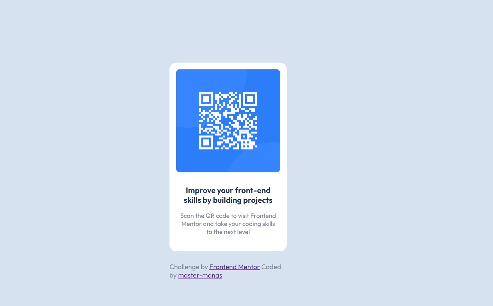

# Frontend Mentor - QR code component solution

This is a solution to the [QR code component challenge on Frontend Mentor](https://www.frontendmentor.io/challenges/qr-code-component-iux_sIO_H). Frontend Mentor challenges help you improve your coding skills by building realistic projects. 

## Table of contents

- [Overview](#overview)
  - [Screenshot](#screenshot)
  - [Links](#links)
- [Author](#author)

**Note: Delete this note and update the table of contents based on what sections you keep.**

## Overview
It is my first challenge on Frontend Mentor.
I designed it using absolute positioning.

### Screenshot

### Links
- Live Site URL: [ URL here](https://643433dbc1587d40ebd1dae1--chic-medovik-f3eb36.netlify.app/)
## Author
- Frontend Mentor - [@madhukar-30](https://www.frontendmentor.io/profile/madhukar-30)

